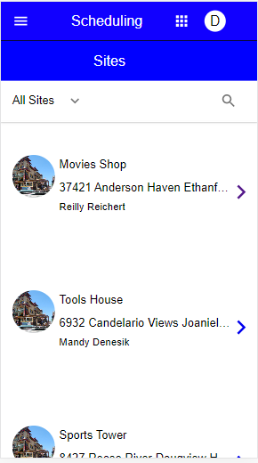

# Front-end Coding Challenge

This is a React application that consists of two pages; one with a complete site list, and a second that displays the details of the site the user has clicked.

The front end uses material-ui for styling.

The back end uses json-server.

# Starting The Application

## Starting The Client

cd coding-challenge

yarn start

or npm start

## Starting The Server

cd coding-challenge/server

json-server --watch db.json --port 4000

# Page One

The first page of the application consists of a list of all sites. Each site includes a site image, the site address, and the main contact. Click on the forward arrow on the right to advance to the site details page.

# Page Two

The second page displays the details of the site the user had clicked. At the top of the page is the name and address of the site, as well as the name of the main site contact. Click on the back arrow to go back to the list of sites.

At the bottom of the second page, you will find the main contact's details; their name and job title, phone number, email address and physical address.

